# UDY-EjemplosLinqCSharp10
## Apuntos cesar
* Formas correctas de utiliza var
    * Solo para cuando hay muchas invocaciones seguidas, esto es mas utilizado para cosas que no tienen mucho sentido y significado
        * Esto solo ayuda para eficientar el codigo
        * 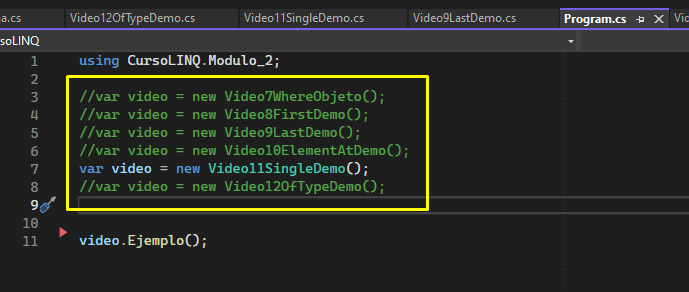

* Aun asi en la mayoria de los casos, hay que evitar el uso de var, ya que al inicio puede ser rapido escribirlo, pero si vuelves a leer el codigo ya te resulta complejo entenderle, pero para el mantenimiento no sirve en absoluto, el uso de var solo lo hacen personas egoistas que solo buscan su propio bien, y no el del proyecto

## Seccion 1: Introduccion

### Sintaxis(Linq de Metodo y Linq de Queries)

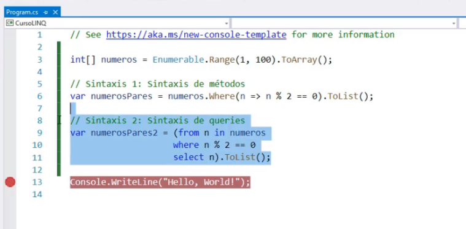

### Video 5: Ejecucion Diferida

* Evaluando de manera no Inmediata

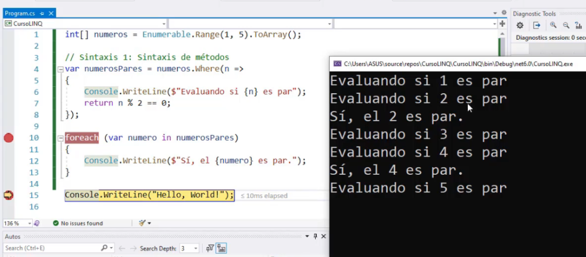

* Evaluando de manera inmediata a traves de ToList

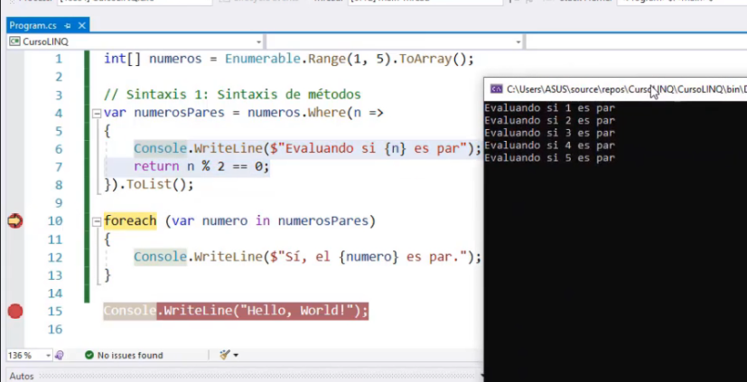

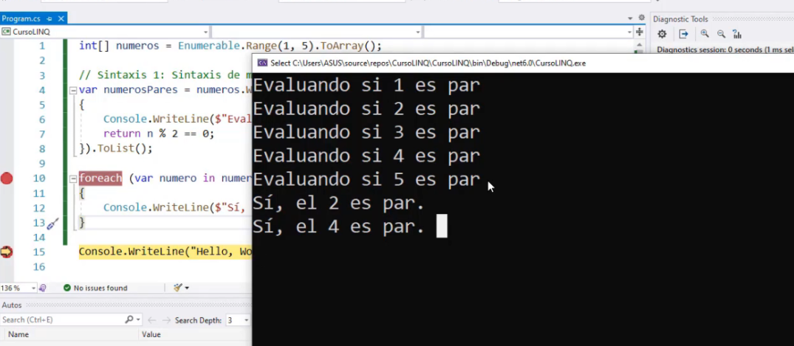

Por lo tanto LinQ, es eficiente en el tema de ejecucion diferida

## Seccion 2:

### Video 6 Funcion Where

### Video 7 Where con Objetos
* Ejemplo
    * 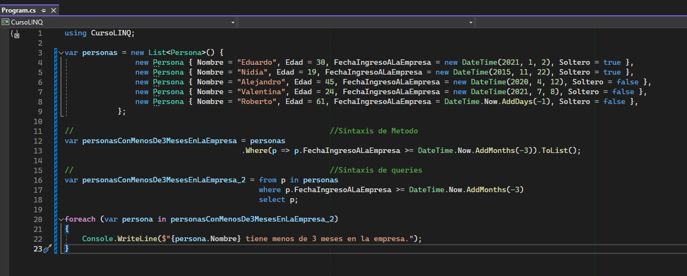
* Ambos dan el mismo resultado
    * 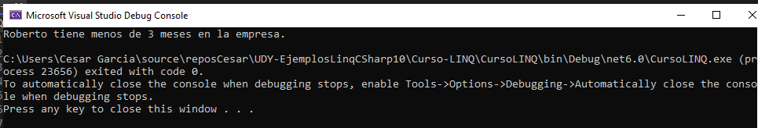

### Video 8 First y FirstOrDefault
* Ejemplo 1
    * 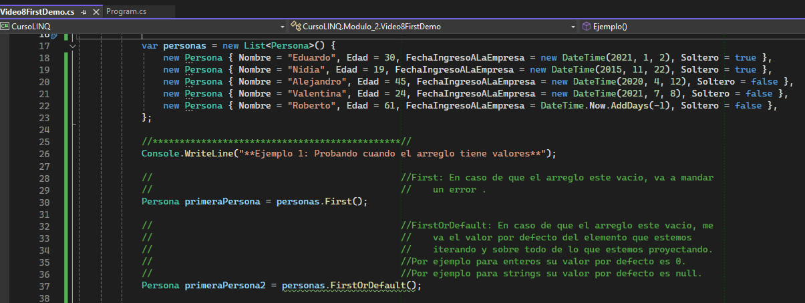
* Ejemplo 2
    * 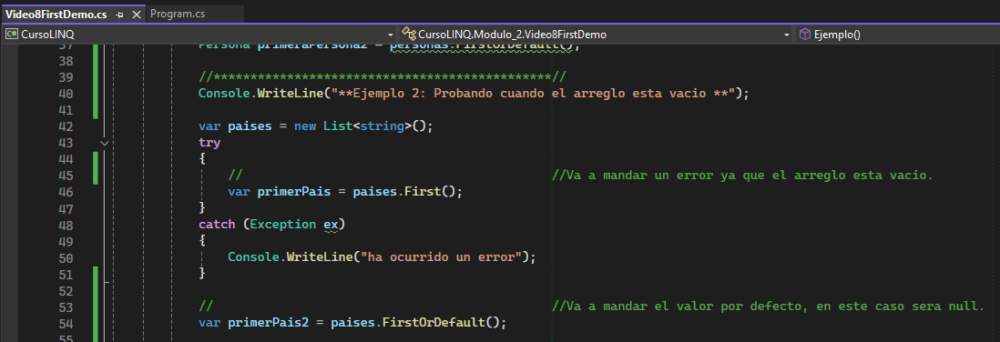
* Otros ejemplos y sintaxis Metodo y Query
    * 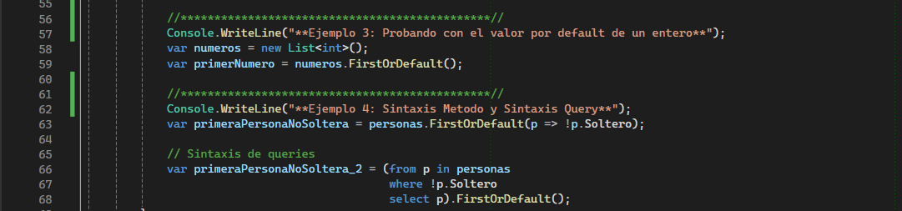
### Video 9 Last y LastOrDefault
* Ejemplo 1
    * 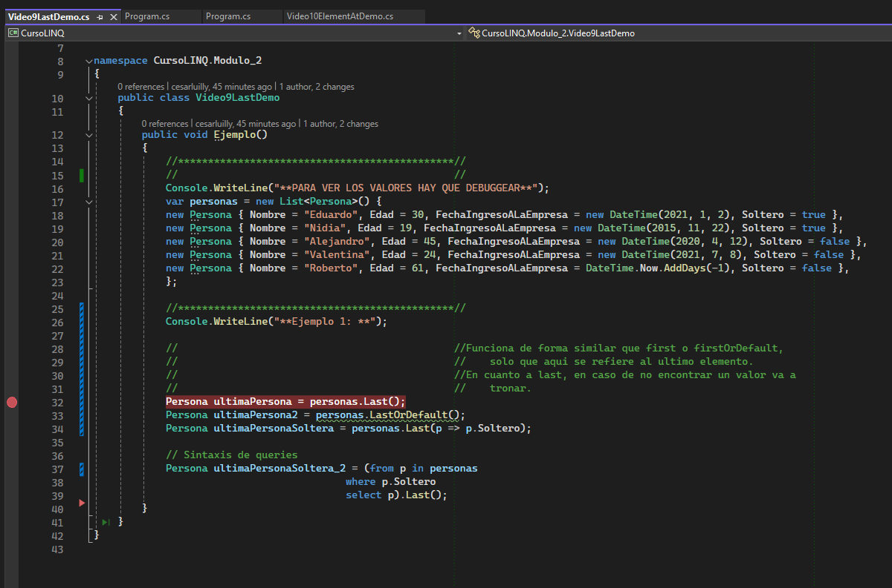

### Video 10 ElementAt y ElementAtOrDefault
Aqui aplica lo mismo, para ElementAt en caso de que no lo encuentre va a mandar un error, 
por lo tanto ElementAtOrDefault en caso de que no encuentre el elemento, va a mandar el valor por default
* Ejemplo 1 
    * 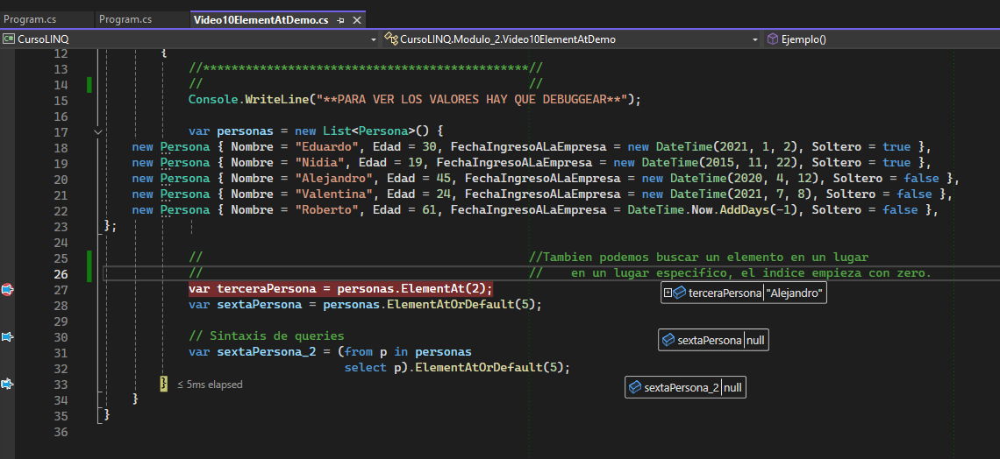
### Video 11 Single y SingleOrDefault

* Esta instruccion permite verficar que la coleccion en base al criterio de busquedad, solo tenga un elemento.
    * Single: si tiene mas de un elemento va a mandar un error
    * SingleOrDefault: si tiene mas de un elemento, solo va a mandar null

* Ejemplo 1
    * 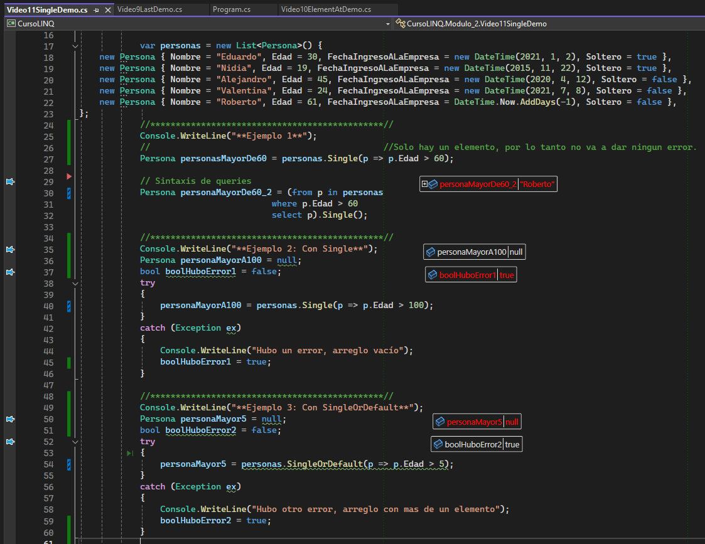
    * 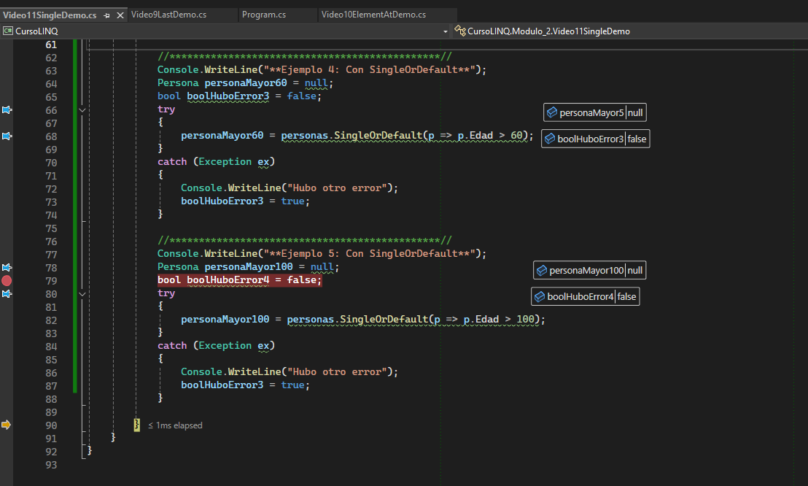

### Video 12 Filtrando por tipo - OfType

Sirve para extraer de una lista que tiene diferentes tipos de objetos, solo un tipo de objeto de todos los que tiene la lista.

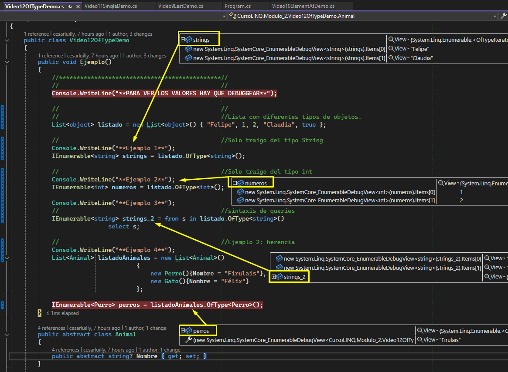

## Seccion 3: Ordenando Elementos

### Video 13 OrdeyBy y OrderByDescending

### Video 14 ThenBy y ThenByDescending

### Video 15 Reverse

## Seccion 4: Proyecciones

### Video 16 Select

### Video 17 SelectMany

## Seccion 5: Escalares

### Video 18 Count y LongCount

### Video 19 Suma, Maximo y Minimo

### Video 20 MaxBy y MinBy(Nuevo de C# 10)

### Video 21 Promedios

### Video 22 Agregados

## Seccion 6: Cuantificadores

### Video 23 All

### Video 24 Any

### Video 25 Contains

## Seccion 7: Paginacion

### Video 26 Take y TakeLast

### Video 27 Skip y SkipLast

### Video 28 Ejemplo de Paginacion

### Video 29 TakeWhile y SkipWhile

## Seccion 8:

### Video 30

### Video 31

## Seccion 9: Relacionando Distintas Colecciones

### Video 32 Join(Inner Join)

### Video 33 GroupJoin(Left Join)

## Seccion 10: Conjuntos

### Video 34 Distinct y DistinctBy(Nuevo de C# 10)

### Video 35 Union y UnionBy (Nuevo de C# 10)

### Video 36 Except y ExceptBy (Nuevo de C# 10)

### Video 37 Intersect y IntersectBy (Nuevo de C# 10)

## Seccion 11: Miscelaneo

### Video 38 Concat

### Video 39 SequenceEqual

### Video 40 Zip

### Video 41 Chunk (Nuevo de C# 10)

### Video 42 TryGetNonEnumeratedCount (Nuevo de C# 10)

## Seccion 12: LINQ Y Bases de Datos - Entity Framework Core

### Video 43 Instalando los Paquetes de Entity Framework Core

### Video 44 Configurando Entity Framework Core

### Video 45 Usando LINQ con Entity Framework Core

### Video 46 LINQ y SQL Server

## Seccion 13:Gracias

### Video 47. Gracias
