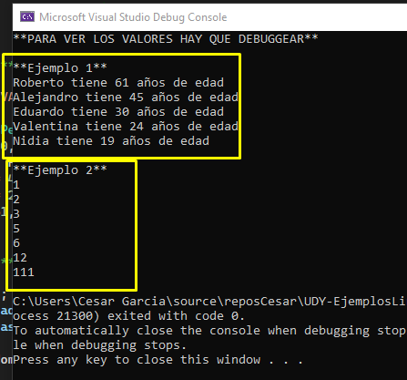

# UDY-EjemplosLinqCSharp10
## Apuntos cesar
* **Formas correctas de utiliza var**
    * Solo para cuando hay muchas invocaciones seguidas, esto es mas utilizado para cosas que no tienen mucho sentido y significado
        * Esto solo ayuda para eficientar el codigo
        * 
    * Aun asi en la mayoria de los casos, hay que evitar el uso de var, ya que al inicio puede ser rapido escribirlo, pero si vuelves a leer el codigo ya te resulta complejo entenderle, pero para el mantenimiento no sirve en absoluto, el uso de var solo lo hacen personas egoistas que solo buscan su propio bien, y no el del proyecto
    * El unico lugar justificable para usar var, es cuando declaramos un objeto anonimo, pero eso es cuando el tipo de objeto no nos interesa mucho porque solo sirve de transicion para calcular otro dato.

* **Identificar el tipo de objeto que devuelve un metodo**
    * 
        * En este caso se refiere a una coleccion de tuplas
        * 

## Entender que es una expresion lambda, ya que al trabajar con LINQ utiliza mucho las expresiones Lambda

https://learn.microsoft.com/es-es/dotnet/csharp/language-reference/operators/lambda-expressions

* Otros ejemplos y su diferencia
    * 
    * 

## Seccion 1: Introduccion

### Sintaxis(Linq de Metodo y Linq de Queries)

### Video 5: Ejecucion Diferida

* Evaluando de manera no Inmediata

* Evaluando de manera inmediata a traves de ToList

Por lo tanto LinQ, es eficiente en el tema de ejecucion diferida

## Seccion 2:

### Video 6 Funcion Where

### Video 7 Where con Objetos
* Ejemplo
    * 
* Ambos dan el mismo resultado
    * 

### Video 8 First y FirstOrDefault
* Ejemplo 1
    * 
* Ejemplo 2
    * 
* Otros ejemplos y sintaxis Metodo y Query
    * 
### Video 9 Last y LastOrDefault
* Ejemplo 1
    * 

### Video 10 ElementAt y ElementAtOrDefault
Aqui aplica lo mismo, para ElementAt en caso de que no lo encuentre va a mandar un error, 
por lo tanto ElementAtOrDefault en caso de que no encuentre el elemento, va a mandar el valor por default
* Ejemplo 1 
    * 
### Video 11 Single y SingleOrDefault

* Esta instruccion permite verficar que la coleccion en base al criterio de busquedad, solo tenga un elemento.
    * Single: si tiene mas de un elemento va a mandar un error
    * SingleOrDefault: si tiene mas de un elemento, solo va a mandar null

* Ejemplo 1
    * 
    * 

### Video 12 Filtrando por tipo - OfType

Sirve para extraer de una lista que tiene diferentes tipos de objetos, solo un tipo de objeto de todos los que tiene la lista.

## Seccion 3: Ordenando Elementos

### Video 13 OrdeyBy y OrderByDescending
* Si queremos ordenar por 2 atributos, utilizamos OrderBy y despues ThenBy

### Video 14 ThenBy y ThenByDescending

Se esta ordenando por Edad Ascendente y Nombre Descendete

### Video 15 Reverse
Podemos revertir el orden de la proyeccion y lo hacemos con `Reverse`
En caso de que a un listado de objetos quieramos aplicarle el reverse, funciona mejor o es mas rapido
hacerlo a traves de un IEnumerable

## Seccion 4: Proyecciones

### Video 16 Select

La funcion select nos permite realizar una proyeccion de los datos, pero tambien
puedo hacer una transformacion mientras estoy en el proceso

### Video 17 SelectMany
Hasta ahora nos la hemos pasado trabajando con una coleccion, sin embargo con LINQ podemos trabajar
varias colecciones de manera simultanea.
Por ejemplo para aplanar las coleciones lo podemos hacer con SelectMany
* Datos iniciales
    * 
* Ejemplo 1
    * 
* Ejemplo 2
    * 
    * 
* Ejemplo 3
    * 
    * 
* Ejemplo 4
    * 
## Seccion 5: Escalares
* En este modulo no vamos a utilizar mucho la sintaxis de Query ya que no hay mucha variacion con respecto a la sintaxis de metodo
### Video 18 Count y LongCount

* Codigo 
    * 
* Corrida
    * 

### Video 19 Suma, Maximo y Minimo
* Codigo
    * 
* Corrida
    * 

### Video 20 MaxBy y MinBy(Nuevo de C# 10)
* Mientras con .Max y .Min me trae solo la edad maxima o minima
* .MaxBy y .MinBy me trae el objeto que tiene la edad maxima o minima correspondiente

### Video 21 Promedios
* Codigo
    * 
* Corrida
    * 

### Video 22 Agregados
* Codigo
    * 
* Corrida
    * 

## Seccion 6: Cuantificadores (Instrucciones que solo devuelven true o false)
* Los cuantificadores nos permiten hacer preguntas como 
    * Son todas las personas de esta coleccion mayores de edad?
    * Existe algun numero negativo en esta coleccion?

**NOTA**. No existen sintaxis de query en cuantificadores, por lo tanto en este modulo no se vera la parte de sintaxis de query

### Video 23 All
* Los cuantificadores nos permiten hacer preguntas como 
    * Son todas las personas de esta coleccion mayores de edad?
    * Son todas las personas de esta coleccion solteros?
        * 

### Video 24 Any

* Podemos tambien verificar si existe al menos un elemento en la coleccion
    * Aqui hacemos la pregunta
    * Existe en la coleccion al menos una persona que sea menor de 18 años?
    * Existe en la coleccion al menos una persona que sea mayor de 20 ?
        * 

### Video 25 Contains
* Contain es una manera de pregunta si un elemento especifico se encuentra dentro de la coleccion
    * 

## Seccion 7: Paginacion
En este modulo no vamos a utilizar la sintaxis de query, ya que las instrucciones para sintaxis de query solo se encierra entre parentes el query y se le aplica la funcion, por lo tanto no hay mucha diferencia que con la sintaxis de metodo
### Video 26 Take y TakeLast
En ocasiones vamos a tenere colecciones muy grandes y vamos a querer entonces solo tomar los n elementos de esa coleccion, para eso podemos utiliza la funcion Take

* 

### Video 27 Skip y SkipLast
Con Skip podemos saltarnos unos cuantos elementos de la ****coleccion
**NOTA: Skip funciona en base Zero** 
* 

### Video 28 Ejemplo de Paginacion
**NOTA: Skip funciona en base Zero** 

Combinando Skip y Take podemos realizar paginaciones
* 
* 

### Video 29 TakeWhile y SkipWhile
Podriamos utilizar condiciones con Take y Skip.

* Por ejemplo si queremos tomas los primeros elementos de una coleccion mientras se cumpla con una condicion indicada, podemos utilizar `TakeWhile`
* Por ejemplo si queremos saltar los elementos de una coleccion mientras se cumple el predicado(condicion), y a partir de que el predicado es False tomar todos los elementos siguiente, podemos utilizar `TakeWhile`
    * 

## Seccion 8: Agrupando

### Video 30 GroupBy Simple

A veses nos resulta util agrupar los elementos de una coleccion en base a una caracteristica especifica

* Datos iniciales
    * 
* Ejemplo 1
    * 
    * 
* Ejemplo 2 (a Traves de Queries)
    * 
    * 

### Video 31 GroupBy Por Rango de Edad
Agrupamiento por Rango de edad, de rango de edad de 5 en 5

**Nota** Aqui el agrupamiento se esta haciendo por el resultado de una division
* Datos Iniciales
    * 
* Ejemplo 1
    * 
    * 
* Ejemplo 2
    * 
    * 

## Seccion 9: Relacionando Distintas Colecciones

### Video 32 Join(Inner Join)
En ocaciones vamos a tener un Join que vamos a querer unir por una valor comun a traves de un Join, 
en el mundo de SQL Server es similar a un InnerJoin

* Expresiones lambda y su diferencia
    * 
    * 

* Datos iniciales
    * 
* Ejemplo 1(Sintaxis de metodo)
    * 
    * 
* Ejemplo 2(Sintaxis de Query)
    * 
    * 

### Video 33 GroupJoin(Left Join)
Ademas de hacer una operacion de relacion utilizando Join, podemos hacer una relacion que ademas de hacer el Join tambien pueda hacer una agrupacion.

Left Join siempre va a traer los registros de la primera tabla y su relacion con la segunda tabla

A continuacion vamos a hacer 
* Una relacion entre Empresa y Persona por el Id correspondiente
* Voy a agrupar a todas las personas que pertenecen a una empresa especifica.
    * Por ejemplo voy a agrupar a Eduardo y Nidia en un mismo grupo ya que pertenecen a la empresa con Id 1

GroupJoin va a poder permitir agrupar y hacer un join al mismo tiempo.

* Datos Iniciales
    * 
* Ejemplo 1 (Sintaxis de Metodo)
    * 
    * 
* Ejemplo 2 (Sintaxis de Query)
    * 
    * 

## Seccion 10: Conjuntos

### Video 34 Distinct y DistinctBy(Nuevo de C# 10)

* Datos Iniciales
    * 
* Ejemplo 1(Sintaxis metodo)
    * 
* Ejemplo 2(Sintaxis Query)
    * 

### Video 35 Union y UnionBy (Nuevo de C# 10)
Con Union podemos unir 2 colecciones y eliminar los duplicados

* Datos Iniciales
    *    
* Ejemplo 1 (Union de 2 listas de tipo int)
    * 
* Ejemplo 1 (Union de 2 listas de objetos, la union es en base al nombre) **Nota** En caso de haber duplicados, tomara el primer elemento de la primera lista
    * 

### Video 36 Except y ExceptBy (Nuevo de C# 10)
* Con Except podemos hacer una comparacion de colecciones donde tengamos todos los elementos de la primera coleccion que no se encuentren en la segunda coleccion

* Visualmente Basandonos en el siguiente grafico
    * 
* Vamos a tener todo lo que esta en A, pero que no este en B, esto es lo que el Except me da como resultado

Empezemos con el codigo y pruebas

* Datos Iniciales
    * 
* Ejemplo 1 
    * 
* Ejemplo 2 (Uso de ExceptBy nuevo en C# 10, esta comparacion en este caso de hace a traves del nombre)
    * 

### Video 37 Intersect y IntersectBy (Nuevo de C# 10)
Podemos utilizar Intersect o IntersectBy para buscar los elementos comunes entre 2 colecciones

* Datos Iniciales
    * 
* Ejemplo 1
    * 
* Ejemplo 2 (IntersectBy nuevo en C# 10) Aqui me va a traer los objetos comunes a traves del nombre
    * 

## Seccion 11: Miscelaneo

### Video 38 Concat
La operacion de concatenacion nos permite juntar 2 colecciones, a diferencia de join este los junta sin eliminar duplicados

* Datos Iniciales
    * 
* Ejemplo 1
    * 
* Ejemplo 2 (Aqui se ve que solo une sin elimina duplicados)
    * 
* **NOTA** No existe sintaxis de Query

### Video 39 SequenceEqual

A veses necesitamos verificar si 2 colecciones tienen exactamente los mismos elementos

* Ejemplos
    * 

### Video 40 Zip
Con ZIP podemos realizar una operacion sobre los elementos respectivos de dos colecciones segun el orden.

Es decir de una lista que tiene 3 elementos voy a combinar segun el Indice
* Lista 1
    * 0 - A
    * 1 - B
    * 2 - C
* Lista 2
    * 0 - a
    * 1 - b
    * 2 - c
* Combinacion
    * 0 - A a
    * 1 - B b
    * 2 - C c

* Identificar el tipo de objeto que devuelve un metodo
    * 
        * En este caso se refiere a una coleccion de tuplas
        * 

* Datos Iniciales
    * 
* Ejemplo 1
    * 
    * 
* Ejemplo 2 Realizando operacion con la informacion de cada tupla
    * 

### Video 41 Chunk (Nuevo de C# 10)

Podemos divir una coleccion en distintas partes utilizando "Chunk"

* Datos Iniciales
    * 
* Ejemplo 1
    * 
    * 

### Video 42 TryGetNonEnumeratedCount (Nuevo de C# 10)

* Puntos importantes
    * Cuando contamos los elementos de una coleccion, esperamos que esta operacion sea sumamente rapida, despues de todo simplemente queremos un numero el cual nos indica la cantidad de elementos de la coleccion

    * Sin embargo, si nuestra coleccion implementa las interfaces adecuadas, esta operacion de conteo va a consistir en recorrer la coleccion para contar la cantidad de elementos, ESTO PUEDE SER INEFICIENTE EN DETERMINADOS ESCENARIOS, `SI QUEREMOS EVITAR ESA INEFICIENCIA, PODEMOS UTILIZAR UNA NUEVA FUNCION DE C# 10 LLAMADA **TryGetNonEnumeratedCount**`

    * Por lo tanto `TryGetNonEnumeratedCount` nos permite verificar si el conteo que se realizo es eficiente.

    * **El motivo por el cual da false** es porque no podemos realizar el conteo sin haber realizado una enumeracion.
        * Cada ves que nos de false, el valor de conteo va a ser Zero ya que no se pudo contar nada
    * **Esto es muy importante en escenarios de alto rendimiento en donde tu de verdad, de verdad necesitas el mayor rendimiento posible**

Procedemos a correr
* Datos iniciales
    * 
* Ejemplo 1
    * 
* Ejemplo 2 Utilizando Count() para ver su funcionamiento
    * 
* Ejemplo 3 La clase implementa de IEnumerable
    * 
* Ejemplo 4 La clase implementa de ICollection
    * 

## Seccion 12: LINQ Y Bases de Datos - Entity Framework Core

**NOTA** `LINQ nos permite conectarnos con diferentes proveedores de bases de datos utilizando el mismo codigo`

### Video 43 Instalando los Paquetes de Entity Framework Core

### Video 44 Configurando Entity Framework Core

### Video 45 Usando LINQ con Entity Framework Core

### Video 46 LINQ y SQL Server

## Seccion 13:Gracias

### Video 47. Gracias
